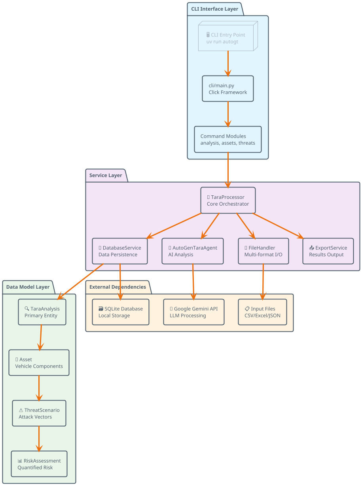
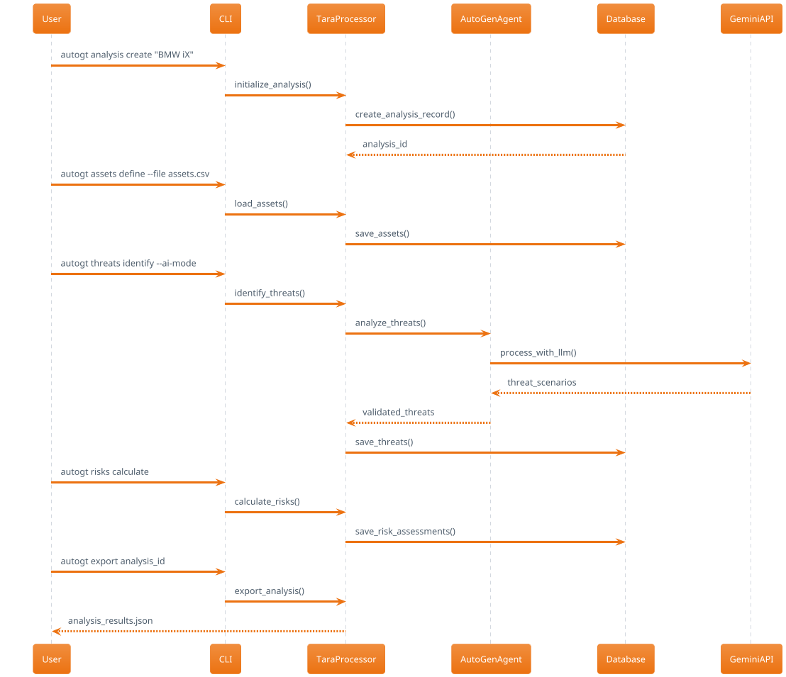
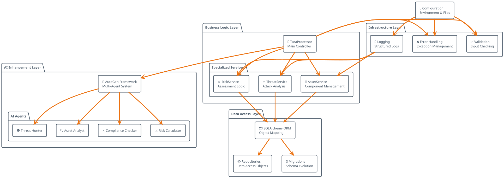
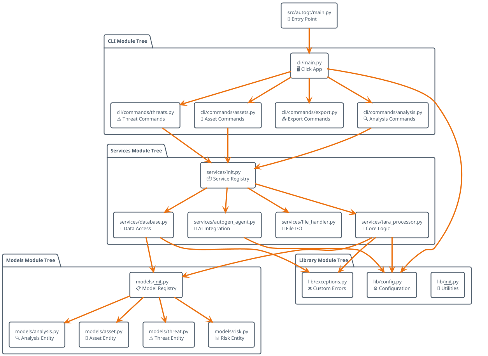
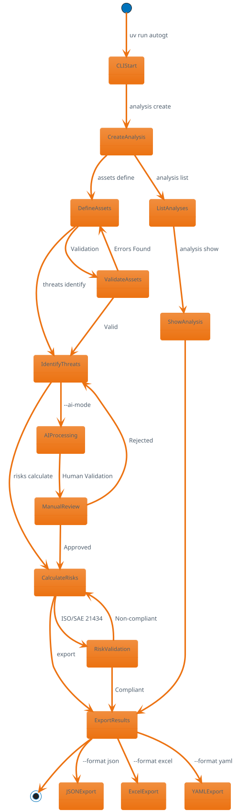

# AutoGT Architecture Network Diagram

## 📊 Visual Architecture Overview



## 🔄 Data Flow Diagram



## 🏗️ Component Interaction Network

```plantuml
@startuml
!theme aws-orange

package "Command Processing" {
  circle "analysis create" as CREATE
  circle "assets define" as DEFINE
  circle "threats identify" as IDENTIFY
  circle "risks calculate" as CALCULATE
  circle "export" as EXPORTCMD
}

package "Core Services Network" {
  rectangle "TaraProcessor\n🎯 Orchestrator" as PROCESSOR
  
  package "Service Cluster" {
    rectangle "DatabaseService\n💾" as DATABASE
    rectangle "AutoGenAgent\n🤖" as AISERVICE
    rectangle "FileHandler\n📁" as FILESERVICE
    rectangle "ExportService\n📤" as EXPORTSERVICE
  }
}

package "Entity Relationships" {
  rectangle "Analysis\n🔍" as ANA
  rectangle "Assets\n🚗" as ASS
  rectangle "Threats\n⚠️" as THR
  rectangle "Risks\n📊" as RSK
  
  ANA ||--o{ ASS : "1:N"
  ASS ||--o{ THR : "1:N"
  THR ||--|| RSK : "1:1"
}

package "External Systems" {
  rectangle "Gemini API\n🧠" as GEMINI_EXT
  rectangle "SQLite DB\n🗃️" as DB_EXT
  rectangle "Input Files\n📋" as FILES_EXT
}

' Command Flows
CREATE --> PROCESSOR
DEFINE --> PROCESSOR
IDENTIFY --> PROCESSOR
CALCULATE --> PROCESSOR
EXPORTCMD --> PROCESSOR

' Service Interactions
PROCESSOR --> DATABASE
PROCESSOR --> AISERVICE
PROCESSOR --> FILESERVICE
PROCESSOR --> EXPORTSERVICE

' External Connections
AISERVICE --> GEMINI_EXT
DATABASE --> DB_EXT
FILESERVICE --> FILES_EXT

' Data Flows
DATABASE --> ANA
DATABASE --> ASS
DATABASE --> THR
DATABASE --> RSK

@enduml
```

## 🔧 Service Dependency Graph



## 📦 Module Import Hierarchy



## 🎯 Usage Pattern Flow



This comprehensive visual architecture shows how AutoGT's components interact, data flows through the system, and how the CLI commands orchestrate the complete TARA workflow. Each diagram highlights different aspects of the system's design and operational patterns.
